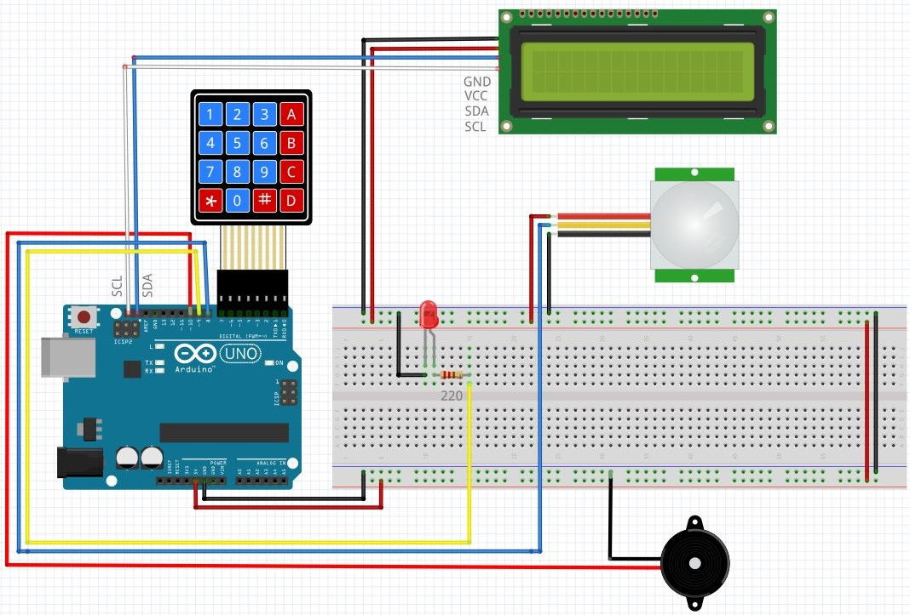

# __L'Alarme domestique__

## Introduction: 
Ce projet conciste à reproduire une alarme domestique à l’aide d’une carte Arduino et quelques autres composants. J'ai utilisé les composants suivant:
* Détecteur de mouvement
* Ecran LCD I2C
* Clavier numérique
* Buzzer
* LED rouge

## Montage électronique
Voici le câblage du projet:



## Structure du projet
```
📦project
│   📜alarme_domestique.ino 
│   📜README.md
│   📜cablage.JPG   
└───📂bilbiotheques_alarme_domestique
    │
    └───📂Keypad
    │   │  ...
    └───📂LiquidCrystal_I2C
    │   │  ...
    └───📂Password
        │  ...

